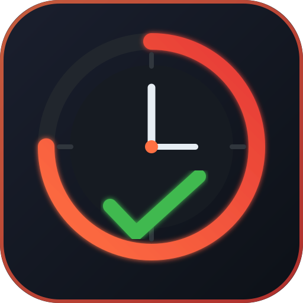

<p>
  
</p>

# orivo

[](https://github.com/mt-shihab26/orivo/actions/workflows/test.yml)

A Pomodoro timer for the desktop, written in [Go](https://go.dev) with [raylib](https://www.raylib.com).

Todos are not managed in orivo: the timer can be pointed at a todo from [Todoist](https://todoist.com) that has the `Work` label and is overdue or due today, and sessions are recorded against it.

## Installation

### [Omarchy](https://omarchy.org)

```sh
git clone --depth 1 https://github.com/mt-shihab26/orivo.git /tmp/orivo
cd /tmp/orivo/pkg
makepkg -si
```

This builds the package from [`PKGBUILD`](pkg/PKGBUILD) using the prebuilt release binary. It installs `orivo` to `/usr/bin`, adds a desktop entry that opens orivo in its own window, and adds an `orivo-sync.timer` user unit. Installing enables that timer, which runs `orivo sync-todoist` once a day at 00:01. If the machine was off at that time, the sync runs after the next boot.

Usage (app launcher):

1. Press `SUPER + ALT + SPACE` to open the app launcher
2. Search for orivo

Usage (terminal):

```sh
$ orivo
```

Uninstall (also disables the `orivo-sync.timer` unit):

```sh
omarchy pkg drop orivo
```

#### Bar widget

[omarchy-orivo-plugin](https://github.com/mt-shihab26/omarchy-orivo-plugin)
adds an Omarchy bar widget showing the current session (Work/Break/Long
Break) and countdown, e.g. `W 24:59`. It reads orivo's live IPC socket
(`~/.local/state/orivo/orivo.sock`) and hides itself when orivo is not
open.

## Build

Requires Go and a C compiler (raylib is compiled from source through cgo), plus the usual OpenGL and X11/Wayland development headers.

```sh
$ git clone https://github.com/mt-shihab26/orivo.git
$ cd orivo
$ go build -o orivo .
$ ./orivo
```

## Keys

| Key       | Action                                             |
| --------- | -------------------------------------------------- |
| `Space`   | Start / pause                                      |
| `r`       | Reset the current phase                            |
| `n`       | Skip to the next phase                             |
| `t`       | Pick a todo (overdue and due today)                |
| `T`       | Clear the selected todo                            |
| `s`       | Sync todos from Todoist                            |
| `m`       | Toggle centiseconds on the clock                   |
| `d`       | Reduce the remaining time (enter `mm:ss`)          |
| `Ctrl+F`  | Toggle the FPS counter                             |
| `Ctrl+Q`  | Quit                                               |

In the todo picker, `j`/`k` or the arrow keys (or the mouse wheel) move, `Enter` or a click selects, and `Esc` cancels.

## Configuration

Config file location: `~/.config/orivo/config.toml`

```toml
# Orivo configuration

show_fps = false # show the FPS counter on startup
font     = ""    # path to a .ttf/.otf font; empty uses the system monospace font

# Pomodoro timer settings — controls session lengths and when long breaks are triggered.
[timer]
show_millis         = false   # show milliseconds in the timer display
work_duration       = 25      # work session length in minutes         (min: 1, max: 120)
break_duration      = 5       # short break length in minutes          (min: 1, max: 60)
long_break_duration = 15      # long break length in minutes           (min: 1, max: 60)
long_break_interval = 4       # work sessions before a long break      (min: 1, max: 10)
daily_session_goal  = 16      # target work sessions to complete today (min: 1, max: 24)
```

### Timer (`[timer]`)

The [Pomodoro technique](https://en.wikipedia.org/wiki/Pomodoro_Technique) breaks work into focused sessions separated by breaks:

- **Work session** → focused work period (default: 25 min)
- **Short break** → rest between sessions (default: 5 min)
- **Long break** → rest after completing a full cycle (default: 15 min)

After every `long_break_interval` work sessions, a long break is triggered instead of a short one.

```
work → break → work → break → work → break → work → LONG BREAK  (cycle of 4)
```

A break starts by itself when a work session ends; the next work session waits for you to start it.

**Daily session goal** (`daily_session_goal`) sets how many work sessions you aim to complete each day. Progress is shown at the top of the window.

### Colors

On [Omarchy](https://omarchy.org), orivo uses the colors of the current theme, read from `~/.local/state/omarchy/current/theme/colors.toml`:

| orivo                | Omarchy key          |
| -------------------- | -------------------- |
| Background           | `background`         |
| Dialog panel         | `lighter_background` |
| Progress track       | `selection`          |
| Dimmed text          | `dark_foreground`    |
| Text                 | `foreground`         |
| Work                 | `red`                |
| Short Break          | `green`              |
| Long Break           | `cyan`               |

Switching the theme with `omarchy-theme-set` recolors orivo straight away, without a restart. Without Omarchy, or for any key the theme is missing or gives as something other than a `#rrggbb` color, orivo uses its own colors, and a problem with the theme file is written to the log.

## Commands

```
orivo                    Open the timer window
orivo connect-todoist    Sign in to Todoist in your browser
orivo sync-todoist       Fetch Work todos that are overdue or due today, and cache them
orivo version            Print the version
orivo help               Show the list of commands
```

## Todos

Connect once, then sync whenever you want the picker to catch up with Todoist:

```sh
$ orivo connect-todoist   # opens Todoist in your browser to sign in and approve access
$ orivo sync-todoist      # fetches, caches and prints the todos labelled Work that are overdue or due today
```

`connect-todoist` works like `gh auth login`: it opens the Todoist sign-in page, waits on a local port for the approval, and saves the result to `~/.local/state/orivo/todoist-auth.json`. Todoist access tokens last an hour, so `sync-todoist` renews the sign-in by itself when needed. If the browser route is not an option, `orivo connect-todoist --token` asks for a personal API token instead (Todoist: Settings > Integrations > Developer), and setting `TODOIST_API_TOKEN` in the environment takes precedence over the saved sign-in.

`sync-todoist` writes the cache to `~/.local/state/orivo/todoist.txt`, one todo per line as the due date, the Todoist id and the text, separated by tabs:

```
2026-10-02	6X7rM8997g3RQmvh	Write the quarterly report
```

The picker (`t`) reads that file and lists the todos in two sections, **Overdue** and **Today**. Pressing `s` in the window runs the same sync in the background, so the picker shows whatever the last sync fetched, from either place.

When a work session on a todo ends, orivo puts today's session count and minutes in brackets at the end of that task's title in Todoist, and replaces them on the next session instead of adding more. It uses the title because a recurring task loses its description when completed. The counts come only from orivo's own session files and start from zero each day, so the first session on a new day overwrites whatever a recurring task carried over from the day before, and the brackets are stripped from the titles orivo syncs down. A sync also clears the brackets from every due task with no session today, so a recurring task completed yesterday, or one you have not started yet today, does not show an old count. A sentence older versions left in the description is cleared out on the next update:

```
Write the quarterly report (4, 100 min)
```

The update is queued in `~/.local/state/orivo/todoist-outbox.txt` and sent in the background right away, together with anything else queued. To go easy on Todoist, sends are at least a minute apart: a session that ends sooner after the last send waits out the rest of that minute. If a send fails (offline, or the sign-in expired), the updates stay queued for the next session or sync. Every request orivo makes to Todoist is written to the log (see Files) with its answer and how long it took, and each background sync with the time since the last one. Writing titles needs read and write access to Todoist. If you connected before orivo asked for it, run `orivo connect-todoist` again; until then, syncs fail with an error that says so.

## Files

Runtime state lives under `~/.local/state/orivo/`:

- `store.json` → the current phase, the selected todo, and the time left per todo
- `sessions/YYYY-MM-DD.jsonl` → one line per completed session, one file per day it ended on; all days are kept
- `todoist.txt` → the cached Todoist todos (see above)
- `todoist-auth.json` → the Todoist sign-in
- `todoist-outbox.txt` → session counts waiting to be written to Todoist (see above)
- `orivo.sock` → Unix socket that answers each connection with one JSON line describing the live timer (phase, running, remaining time, todo, sessions today), for bar widgets such as [omarchy-orivo-plugin](https://github.com/mt-shihab26/omarchy-orivo-plugin)
- `logs/orivo-YYYY-MM-DD.log` → warnings, errors and every request sent to Todoist, one file per week named after the Saturday it starts on; only the current week is kept

## Structure

The window is built like a game. All of it lives in `src/domains/root`: `app.go` runs the loop, and everything in it is an entity under `entities/` (the clock, the session bar, the todo picker, …). Every entity is created by its package's `New` function and implements the same three methods, defined in `src/domains/root/core`:

```go
type Entity interface {
	Close()
	Update(dt float32)
	Draw()
}
```

An entity is something that is drawn, and each one keeps its own logic and key handling in its `Update`, reading the keyboard straight from raylib. Entities form a tree: a parent creates, updates, draws and closes its children, and the folders mirror it. Each entity is its own package, nested under its parent.

```
src/domains/root/
├─ app.go
├─ core/                      the entity contract, fonts and screen helpers
└─ entities/
   ├─ top_bar/
   ├─ hints/
   ├─ dialog/                    the base both dialogs embed
   └─ session_bar/
      └─ clock/
         ├─ todo_label/
         │  └─ todo_picker/      embeds dialog
         └─ reduce_dialog/       embeds dialog
```

`Clock` is the timer: it handles Space, `r`, `n` and `m`, counts down, rolls from one phase to the next, records sessions and saves. `Dialog` is the base both dialogs embed; it owns open and closed, Esc to dismiss, and the backdrop, panel, title and hint. Keys follow the tree: a parent reads its own keys only while none of its dialogs is open, and stops updating the other branch meanwhile, so nothing behind an open dialog reacts. `app.go` only opens the window, loads the theme, creates the top-level entities and runs the loop.

The packages under `src/systems` are helpers the entities call: the phase names, durations and colors, the session history, the store, the todo cache, the Todoist client, the Omarchy theme loader and watcher, the status socket, notifications and signal handling.

Each command is one file in `src/commands` implementing the `Command` interface, and only routes: its logic lives in a folder of its own under `src/domains` (`root`, `connect_todoist`, `sync_todoist`). `commands.go` routes the first argument to the command with that name:

```go
type Command interface {
	Name() string
	Summary() string
	Run(args []string) error
}
```

## Development

```sh
$ ./dev.sh           # build and run with config and state under ./.dev instead of the system paths
$ go test ./...     # run the test suite
$ gofmt -l .        # check formatting
$ go vet ./...      # lint
```

## Releasing

Releases go out from `main`. The version comes from the git tag and is passed to the binary at build time with `-ldflags "-X main.version=..."`, so you don't edit a version anywhere in the source.

1. Open a pull request into `main` titled `Release vX.Y.Z`. The Test and Format workflows run on it.
2. Merge it after CI passes.
3. Create the release and its tag on `main`:

   ```sh
   $ gh release create vX.Y.Z --target main --generate-notes
   ```

Create the release with `gh release create` rather than pushing a bare tag. The workflow uploads into an existing release, so it fails if the release isn't there yet.

The new `vX.Y.Z` tag starts the Build workflow (`.github/workflows/build.yml`), which:

- builds `orivo-vX.Y.Z-linux-x86_64` and `orivo-vX.Y.Z-linux-aarch64`, each on its own runner
- uploads both binaries to the release, along with `orivo-omarchy.desktop`, `orivo.svg` and `SHA256SUMS.txt`
- sets `pkgver` in `pkg/PKGBUILD`, refreshes its checksums and `pkg/.SRCINFO`, and pushes that commit to `main`

After a release, pull `main` so you have the PKGBUILD bump locally.
